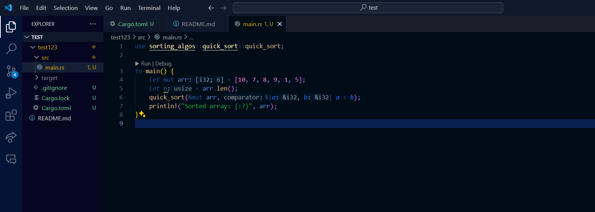

Sorting Algos Lib in Rust:

Usage:
Add dependency into your project
		```
		[dependencies]
		sorting_algos = { git = "https://github.com/MakyKari/BCH-HW1" }
  		```

open any Rust file and type
	```use sorting_algos::quick_sort::quick_sort;```
or use merging sort, selection sort or insertion sort




Example: 
    ```
    let mut arr = [10, 7, 8, 9, 1, 5];
    quick_sort(&mut arr, &|a, b| a < b);
    println!("Sorted array: {:?}", arr);
    ```